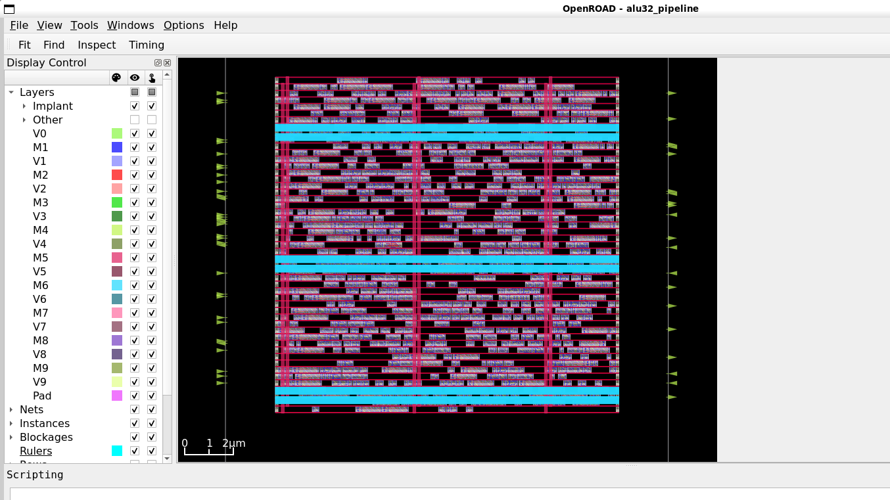

# Day 2 — RTL to CTS: Simulation, SDC, Synthesis, STA & Physical Design

## Objective

Build and take a small **32-bit pipelined ALU** through the early stages of an ASAP7 RTL-to-GDSII flow using OpenROAD-flow-scripts (ORFS).

This day combines the originally planned Day 2 and Day 3 work into one milestone. The goal is not only to run the flow, but to understand what each stage produces and how timing/physical information evolves.

---

## 1. Design Under Test

The design is a 32-bit pipelined arithmetic/logic unit.

### Inputs

| Signal | Width | Description |
|---|---:|---|
| `clk` | 1 | Clock |
| `rst` | 1 | Synchronous reset |
| `A` | 32 | Operand A |
| `B` | 32 | Operand B |
| `op` | 3 | Operation select |

### Output

| Signal | Width | Description |
|---|---:|---|
| `Y` | 32 | Registered ALU result |

### Supported operations

| `op` | Operation |
|---|---|
| `000` | ADD |
| `001` | SUB |
| `010` | AND |
| `011` | OR |
| `100` | XOR |

### Pipeline structure

```text
A / B / op
    |
    v
Input pipeline registers
    |
    v
 ALU combinational logic
    |
    v
Output register Y
```

This creates a real register-to-register timing path:

```text
A_reg / B_reg / op_reg -> ALU -> Y
```

---

## 2. RTL Simulation

The RTL was simulated with **Icarus Verilog 11.0** and the waveform was inspected using **GTKWave**.

The functional checks produced:

```text
ADD: A=10 B=20 Y=30
SUB: A=30 B=10 Y=20
AND: A=0f0f0f0f B=00ff00ff Y=000f000f
OR : A=0f0f0f0f B=00ff00ff Y=0fff0fff
XOR: A=0f0f0f0f B=00ff00ff Y=0ff00ff0
```

The waveform confirmed the expected one-cycle pipelined behavior.

---

## 3. Timing Constraints — SDC

The design was constrained using an SDC file.

### Important ASAP7 library discovery

The ASAP7 Liberty files used in this flow specify:

```text
time_unit : "1ps";
```

Therefore the timing values in the SDC were expressed in **picoseconds**, not nanoseconds.

The learning clock constraint is:

```tcl
create_clock -name clk -period 10000.0 [get_ports clk]
```

which corresponds to a **10 ns clock period**.

Other constraints include input/output delays and clock transition.

The final clock uncertainty was deliberately separated into setup and hold components:

```tcl
set_clock_uncertainty -setup 200.0 [get_clocks clk]
set_clock_uncertainty -hold 0.0 [get_clocks clk]
```

### Why separate setup and hold uncertainty?

The earlier learning constraint applied 200 ps to both setup and hold. After CTS, this produced artificial hold violations on very short paths. Since the 200 ps value was an assumed learning constraint rather than a characterized hold uncertainty, the constraint was changed to:

- Setup uncertainty = 200 ps
- Hold uncertainty = 0 ps

The flow was then regenerated and CTS was rerun with timing repair enabled.

---

## 4. Synthesis

Synthesis was performed using **Yosys** through ORFS with the ASAP7 platform.

### Synthesis debugging: inferred latch

The first synthesis produced an unexpected increase in sequential cells:

```text
Sequential cell = 131
```

The intended design contains 99 flip-flop bits:

- `A_reg` = 32 bits
- `B_reg` = 32 bits
- `op_reg` = 3 bits
- `Y` = 32 bits
- Total = **99 FF bits**

The additional 32 sequential elements were caused by the incomplete combinational `case` statement in the ALU. Without a `default` assignment, synthesis inferred a 32-bit latch.

### Fix

The combinational logic was changed to include:

```verilog
default: alu_result = 32'b0;
```

After resynthesis:

```text
Standard cell area ≈ 100.47 um²
Sequential cells = 99
Total cells = 807
```

This was a useful synthesis-debugging example: an RTL coding issue directly changed the synthesized hardware structure.

---

## 5. Post-Synthesis STA

After loading the synthesized database and the ASAP7 FF NLDM Liberty libraries, timing was analyzed using OpenROAD/OpenSTA.

A representative worst register-to-register setup path was:

```text
Startpoint: op_reg[0]
Endpoint:   Y[17]
Data arrival ≈ 444.00 ps
Required time ≈ 9798.27 ps
Slack ≈ +9354.27 ps
```

No setup violations were reported.

### Important observation

The first timing report initially showed extremely large negative slack because the SDC values had been interpreted in ps while they were written as if they were ns. Inspecting the Liberty `time_unit` exposed the issue.

This was corrected before continuing the physical-design flow.

---

## 6. Floorplan

The ORFS floorplan was generated using:

```makefile
CORE_UTILIZATION = 50
CORE_ASPECT_RATIO = 1.0
CORE_MARGIN = 2.0
```

The resulting floorplan was approximately square.

### Key results

```text
Core area        ≈ 194.07 um²
Core width       ≈ 14.094 um
Core height      ≈ 13.770 um
Rows             = 51
Site             = asap7sc7p5t
```

The ASAP7 standard-cell site dimensions are approximately:

```text
0.054 um × 0.270 um
```

The floorplan GUI was also inspected to understand the relationship between the die boundary, core boundary, rows, pins and standard-cell placement area.

---

## 7. Placement

Placement was performed using the ORFS `place` target.

The placement flow included:

```text
Global placement
    |
I/O placement
    |
Global placement refinement
    |
Placement resizing
    |
Detailed placement
```

### Placement result

```text
Original HPWL       ≈ 1710.5 um
Final HPWL          ≈ 1575.2 um
HPWL improvement    ≈ 7.9%
Final utilization    ≈ 56%
```

Post-placement setup timing on the representative worst path was approximately:

```text
Slack ≈ +9282.19 ps
```

Compared with post-synthesis slack of approximately +9354.27 ps, placement added roughly 72 ps of delay to the worst path.

---

## 8. Standard-Cell Physical Representation

The OpenROAD GUI was used to inspect the placed physical design.

The GUI view shows the **standard-cell rows and individual standard-cell instances**, together with routing layers, vias, pins and power-related structures.



This view is useful for connecting the logical netlist to its physical implementation:

```text
RTL / netlist
     |
     v
Standard-cell instances
     |
     v
Placement inside legal rows
     |
     v
Routing layers + vias
```

The standard cells are not arbitrary rectangles. Their placement is constrained by the technology-defined site and row structure, while their physical connectivity is created by routing on the available metal layers.

---

## 9. Clock Tree Synthesis (CTS)

CTS was performed using TritonCTS through the ORFS `cts` target.

The first CTS attempt exposed an important timing-repair issue:

```text
Found 32 endpoints with hold violations.
Inserted 204 hold buffers.
ERROR RSZ-0066: Max buffer count reached.
```

Instead of simply bypassing the issue permanently, the timing constraints were investigated. The root cause was the 200 ps hold uncertainty applied to the learning design.

After changing the SDC to use 200 ps setup uncertainty and 0 ps hold uncertainty, placement was regenerated and CTS was rerun with timing repair enabled.

### Final CTS result

```text
CTS completed successfully
Detailed placement: 994 cells
Core area:            194.07 um²
Utilization:           57.3%
```

Generated databases:

```text
4_1_cts.odb
4_cts.odb
4_cts.sdc
```

The CTS run also passed the reported LEC check.

---

## 10. Post-CTS Timing Verification

### Hold timing

The following check returned:

```text
No paths found.
```

for:

```tcl
report_checks -path_delay min \
  -from [all_registers] \
  -to [all_registers] \
  -slack_max 0 \
  -group_path_count 10
```

This means there were no register-to-register hold violations under the corrected 0 ps hold uncertainty.

### Setup timing

The maximum-delay check also returned:

```text
No paths found.
```

Therefore no register-to-register setup violations were reported after CTS.

### Clock skew

The CTS clock report showed:

```text
Source latency      43.99 ps
Target latency     -40.55 ps
Clock uncertainty  200.00 ps
CPR                  -1.00 ps
Setup skew          202.44 ps
```

The negative target latency should not be interpreted as the clock physically travelling backwards. It is a latency value relative to the clock-tree reference used by the timing analysis.

---

## 11. Current Flow Status

```text
RTL                         ✓
RTL simulation              ✓
SDC constraints             ✓
Synthesis                   ✓
Post-synthesis STA          ✓
Floorplan                   ✓
Placement                   ✓
CTS                         ✓
Post-CTS setup              ✓
Post-CTS hold               ✓

Global routing              → Next
Post-route STA              → Pending
DRC                         → Pending
LVS / physical verification → Pending
GDSII                       → Pending
```

---

## 12. Key Lessons From This Milestone

1. **Library units matter.** Always check Liberty `time_unit` before writing timing constraints.
2. **RTL coding style affects physical implementation.** An incomplete combinational `case` inferred 32 latch bits.
3. **Synthesis results must be sanity-checked.** The expected 99 FF bits provided a simple way to detect the unintended latches.
4. **Placement changes timing.** Wirelength and physical parasitics can increase path delay even when the logic is unchanged.
5. **CTS makes clock timing physical.** After clock-tree construction, skew and propagated clock delays become part of timing analysis.
6. **Do not blindly repair artificial violations.** The hold issue was traced back to the assumed hold uncertainty before accepting large amounts of buffering.
7. **Timing must be checked after every major physical stage.** Clean synthesis timing does not guarantee clean post-placement or post-CTS timing.

---

## Next Milestone

The next step is **global routing**, followed by post-route timing analysis and physical signoff checks.
