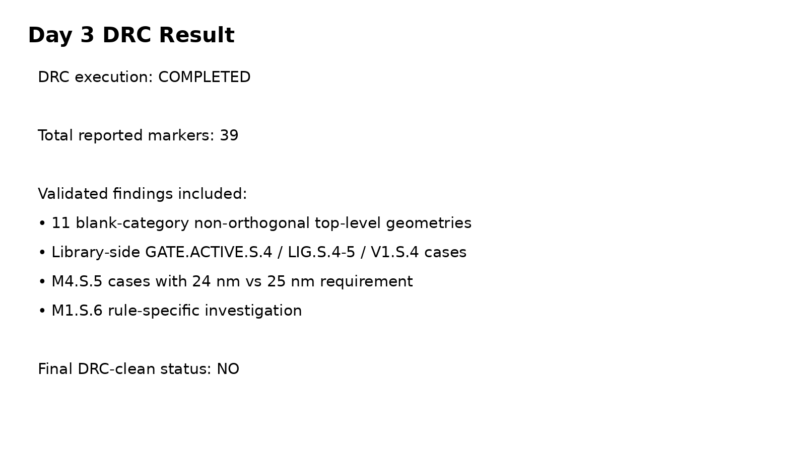
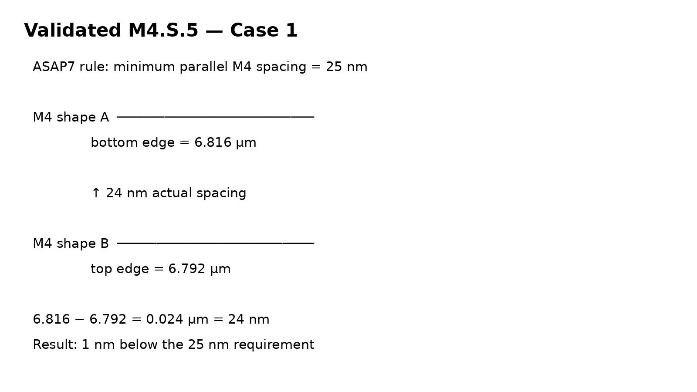
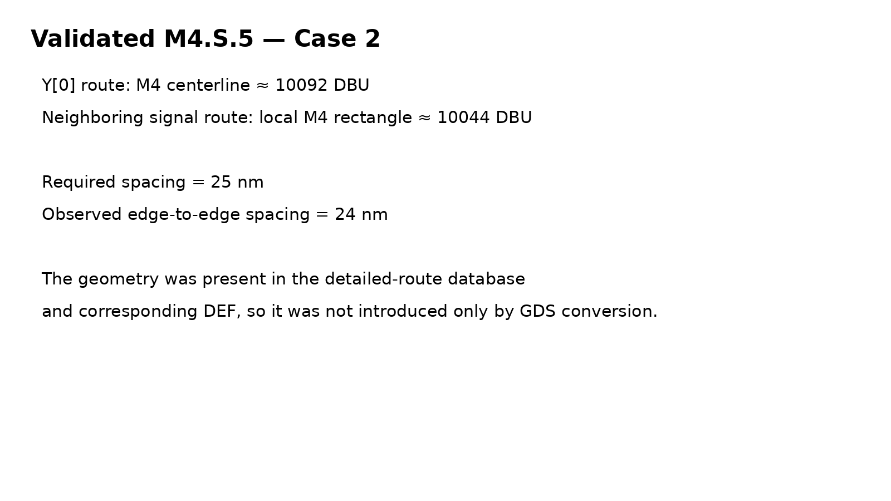
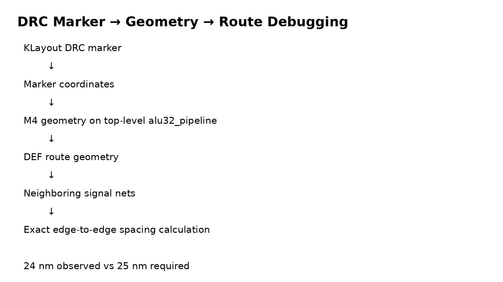

# Day 03 — Detailed Routing, Post-Route STA, GDSII & DRC

> **Project:** ASAP7 7nm RTL-to-GDSII  
> **Design:** 32-bit pipelined arithmetic ALU  
> **Flow:** OpenROAD-flow-scripts / OpenROAD / KLayout  
> **Technology:** ASAP7 predictive PDK platform

---

# 1. Day 3 Objective

Day 1 established the ASAP7 physical-design environment and library/technology concepts.

Day 2 took the 32-bit pipelined ALU from RTL through synthesis, floorplanning, placement and CTS.

**Day 3 completes the back-end implementation path from CTS to routed layout, then performs post-route timing, GDSII generation and DRC.**

The main goal was not only to run commands, but to understand:

- what detailed routing does;
- how routing layers and vias are used;
- what changes after routing;
- how post-route STA differs from synthesis/pre-route STA;
- how GDSII is generated;
- how DRC is performed;
- how to investigate a real physical DRC marker;
- how to distinguish top-level routing violations from library-side violations;
- how to preserve a known-good baseline while experimenting.

---

# 2. Design and Flow Context

The design is a **32-bit pipelined ALU** with:

```text
Inputs:
    A   [31:0]
    B   [31:0]
    op  [2:0]
    clk
    rst

Output:
    Y   [31:0]
```

The datapath contains input registers, combinational ALU logic and an output register:

```text
A/B/op
   │
   ▼
Input pipeline registers
   │
   ▼
ALU combinational logic
   │
   ▼
Output register
   │
   ▼
Y
```

Therefore the implemented design contains genuine register-to-register timing paths that can be analyzed after routing.

---

# 3. Complete RTL-to-GDSII Flow

The project now follows:

```text
RTL
 │
 ▼
Simulation
 │
 ▼
Synthesis
 │
 ▼
Floorplan
 │
 ▼
Placement
 │
 ▼
CTS
 │
 ▼
Global Routing
 │
 ▼
Detailed Routing
 │
 ▼
Filler / Finalization
 │
 ▼
Post-route STA
 │
 ▼
GDSII
 │
 ▼
DRC
```

Day 3 mainly covers:

```text
CTS
 ↓
Routing
 ↓
Post-route STA
 ↓
GDSII
 ↓
DRC
```

---

# 4. What Is Routing?

After placement and CTS, standard cells have physical locations and the clock network has been built, but signal connections still need physical metal interconnect.

Routing creates those connections using:

- metal layers;
- vias;
- routing tracks;
- horizontal/vertical wires;
- technology-specific spacing and width rules.

Conceptually:

```text
Placed cells

┌─────┐          ┌─────┐
│ FF  │          │ FF  │
└─────┘          └─────┘
    │                │
    └──── metal ─────┘
```

The router must choose a physical path that connects the correct pins while obeying the technology rules.

---

# 5. Routing Layers in ASAP7

The project used:

```text
MIN_ROUTING_LAYER = M2
MAX_ROUTING_LAYER = M7
```

So the router had the range:

```text
M2
M3
M4
M5
M6
M7
```

available for routing.

The technology defines preferred directions, widths, spacing and via rules for these layers.

The router cannot simply draw arbitrary wires anywhere. It must use legal routing tracks and legal layer transitions.

A via is used when a connection changes metal layer:

```text
M3
───────┐
       │ VIA
───────┘
M4
```

---

# 6. Global Routing vs Detailed Routing

This distinction is important in physical-design interviews.

## Global Routing

Global routing determines an approximate routing path and routing resources.

It answers questions such as:

> Which routing regions should this net cross?

Conceptually:

```text
Source
  │
  ▼
┌───┬───┬───┬───┐
│   │   │   │   │
├───┼───┼───┼───┤
│       │       │
├───────┼───────┤
│       │       │
└───────┴───────┘
            │
          Sink
```

It is an abstraction of the eventual route.

## Detailed Routing

Detailed routing converts the approximate route into actual physical geometry:

```text
exact track
exact wire width
exact wire segment
exact via
exact spacing
```

It must satisfy the technology's detailed design rules.

Therefore:

```text
Global route:
    approximate path

Detailed route:
    exact physical wires + vias
```

A design can have a successful global route but still fail detailed routing.

---

# 7. Routing Output Files

Important ORFS route-stage files include:

```text
5_1_grt.odb
5_2_route.odb
5_3_fillcell.odb
5_route.sdc
```

The important final routed database used in this project was:

```text
results/asap7/alu32_pipeline/base/5_route.odb
```

The routed SDC was:

```text
results/asap7/alu32_pipeline/base/5_route.sdc
```

The route database contains the implemented physical design after routing.

---

# 8. Detailed Routing Completed

The baseline routing configuration:

```text
M2 → M7
```

completed successfully.

The final routed implementation was then used for:

```text
post-route STA
GDS generation
DRC
```

The route stage also inserted filler cells during the subsequent fill-cell stage.

The route output reported approximately:

```text
Placed 1005 filler instances
```

---

# 9. Why Are Filler Cells Added?

Filler cells are physical-only cells used to fill gaps between standard cells.

They help maintain required physical continuity and manufacturing-related structures across the standard-cell rows.

Conceptually:

```text
Logic   Logic       Logic
[AND]   [OR]       [INV]

       gap

Logic  FILLER  Logic
[AND]  [FILL]  [INV]
```

Filler cells are different from functional logic cells.

They generally do not implement the user's RTL function. They provide physical continuity/density and technology-required structures.

---

# 10. Antenna Check

The routing stage reported:

```text
[INFO ANT-0001] Found 0 pin violations.
```

Antenna effects occur when manufacturing processes can cause charge accumulation on long conductive structures connected to sensitive device terminals, particularly during fabrication.

A routing flow can use antenna-aware routing and/or antenna diodes depending on the technology and flow.

For this design, the reported antenna check did not identify pin violations.

---

# 11. Controlled Routing Experiment

To understand the effect of routing-layer restrictions, a controlled experiment was performed.

### Baseline

```text
MIN_ROUTING_LAYER = M2
MAX_ROUTING_LAYER = M7
```

### Experiment

```text
MIN_ROUTING_LAYER = M3
MAX_ROUTING_LAYER = M7
```

The M3 experiment was forced to rebuild routing.

Detailed routing failed:

```text
[ERROR DRT-0255] Maze Route cannot find path of net _0003_
```

The error occurred inside the detailed-router route box.

### Interpretation

Removing M2 reduced the routing resources available to the router.

For this particular design/configuration, at least one net could not be legally completed using only M3–M7.

### Recovery

The known-good configuration was restored:

```text
M2 → M7
```

The successful baseline routed database was protected before experimentation:

```text
5_route_baseline.odb
5_route_baseline.sdc
```

This is an important practical lesson:

> Always preserve a known-good implementation before changing routing or optimization settings.

---

# 12. Post-Route STA

After detailed routing, timing was checked again.

The post-route STA setup was:

```text
OpenROAD
    ↓
read routed ODB
    ↓
read ASAP7 FF NLDM Liberty
    ↓
read post-route SDC
    ↓
report setup/hold paths
```

The post-route database used:

```text
5_route.odb
```

The timing libraries were the ASAP7 FF NLDM libraries.

The post-route SDC was:

```text
5_route.sdc
```

---

# 13. Why Post-Route STA Matters

Timing changes as the design moves through implementation.

A simplified progression is:

```text
Synthesis STA
      ↓
Placement STA
      ↓
CTS STA
      ↓
Post-route STA
```

Each implementation stage introduces more physical information.

After routing, actual routed connectivity and propagated clock behavior can affect timing.

The post-route check therefore answers:

> Does the physically implemented design still meet the timing constraints?

---

# 14. Setup Timing

The setup timing command was:

```tcl
report_checks -path_delay max \
  -from [all_registers] \
  -to [all_registers] \
  -group_path_count 10
```

The worst reported setup path was:

```text
Startpoint: op_reg[0]
Endpoint:   Y[28]
```

The path contained:

```text
DFF
 ↓
INV
 ↓
BUF
 ↓
AO33
 ↓
XNOR
 ↓
HA
 ↓
OR
 ↓
OA
 ↓
XNOR
 ↓
OA
 ↓
NOR
 ↓
DFF
```

The reported values were:

```text
Data arrival time  = 546.21 ps
Data required time = 9831.28 ps
Slack              = +9285.07 ps
```

Therefore:

```text
+9285.07 ps
= +9.28507 ns
```

and the path met setup timing.

---

# 15. Understanding the Setup Report

The key sections of the report were:

```text
clock network delay
clock-to-Q
combinational cell delays
data arrival time
capture clock network delay
clock uncertainty
clock reconvergence pessimism
library setup time
data required time
slack
```

For the worst reported path:

```text
Launch clock network delay = 43.76 ps

Data arrival               = 546.21 ps

Capture clock network      = 40.65 ps
Clock uncertainty          = 200 ps
CRPR                       = 1 ps
Library setup              = 10.37 ps

Required time              = 9831.28 ps

Slack                      = 9831.28 - 546.21
                           = +9285.07 ps
```

The exact report contains the individual timing contributions.

---

# 16. Another Setup Path

Another reported path was:

```text
Startpoint: op_reg[2]
Endpoint:   Y[17]
```

with:

```text
Data arrival time  = 548.86 ps
Data required time = 9836.67 ps
Slack              = +9287.81 ps
```

This also met setup timing.

---

# 17. Why Setup Slack Is So Large

The design clock is:

```text
10 ns
```

while the implemented ALU combinational paths are approximately:

```text
0.5 ns
```

Therefore there is a large amount of timing margin.

This does not mean the design would automatically remain timing-clean at a much faster target frequency. The clock period is a design constraint, and changing it would change the required timing.

---

# 18. Setup Comparison Across the Flow

We observed approximately:

```text
Synthesis:
    worst setup slack ≈ +9354 ps

Placement:
    worst setup slack ≈ +9282 ps

Post-route:
    worst setup slack ≈ +9285 ps
```

The exact worst path can change between stages, so these numbers should be treated as stage-specific reported worst paths rather than assuming the identical physical path is always the worst.

The important lesson is:

> Physical implementation changes timing because placement, clock-tree behavior and routing affect the actual timing path.

---

# 19. Hold Timing

Hold timing was checked with:

```tcl
report_checks -path_delay min \
  -from [all_registers] \
  -to [all_registers] \
  -group_path_count 10
```

The worst reported hold path was:

```text
Startpoint: A_reg[3]
Endpoint:   Y[3]
```

Reported values:

```text
Data arrival time  = 111.85 ps
Data required time = 56.51 ps
Slack              = +55.34 ps
```

Therefore:

```text
Hold slack = +55.34 ps
```

and the reported path met hold timing.

---

# 20. Other Reported Hold Paths

Examples:

```text
A_reg[21] → Y[21] : +57.44 ps
A_reg[16] → Y[16] : +57.60 ps
A_reg[10] → Y[10] : +57.62 ps
A_reg[8]  → Y[8]  : +57.62 ps
A_reg[9]  → Y[9]  : +57.62 ps
A_reg[12] → Y[12] : +57.64 ps
```

All of these reported paths had positive hold slack.

---

# 21. Clock Uncertainty Debugging

During CTS debugging, hold repair initially encountered negative hold slack when the same 200 ps uncertainty was being applied to hold.

The constraint was then separated:

```tcl
set_clock_uncertainty -setup 200.0 [get_clocks clk]
set_clock_uncertainty -hold 0.0 [get_clocks clk]
```

This reflects the constraint model selected for this project.

The final post-route hold report then showed positive slack.

### Lesson

Do not automatically assume:

```text
setup uncertainty = hold uncertainty
```

The two checks have different timing requirements, and the uncertainty model should represent the intended timing methodology.

---

# 22. GDSII Generation

After routing and timing checks, the final physical layout was converted to GDSII.

Command:

```bash
make gds DESIGN_CONFIG=./designs/asap7/alu32_pipeline/config.mk
```

Final GDS:

```text
results/asap7/alu32_pipeline/base/6_final.gds
```

Other final physical files included:

```text
6_final.odb
6_final.def
6_final.v
6_final.sdc
6_final.spef
```

---

# 23. ODB vs DEF vs GDS

These formats should not be confused.

## ODB

OpenROAD's database containing the implemented physical design and associated information.

```text
6_final.odb
```

## DEF

Text-based physical design exchange representation containing placement/routing information.

```text
6_final.def
```

## GDSII

Layout geometry representation used in downstream physical/signoff/manufacturing-related flows.

```text
6_final.gds
```

Mental model:

```text
OpenROAD implementation
        │
        ├── ODB
        ├── DEF
        └── GDSII
```

---

# 24. GDS Generation Checks

KLayout reported:

```text
All LEF cells have matching GDS/OAS cells
No orphan cells in the final layout
```

This was useful confirmation that the standard-cell physical references had corresponding GDS/OAS cells.

---

# 25. DBU Warning Investigation

During GDS generation, KLayout reported:

```text
WARN DEF UNITS does not match reader DBU
```

The DEF contained:

```text
UNITS DISTANCE MICRONS 1000 ;
```

which corresponds to:

```text
1 DEF database unit = 0.001 µm
```

The KLayout technology configuration used:

```text
dbu = 0.00025 µm
```

The difference means KLayout's internal grid is finer than the DEF coordinate grid.

The physical dimensions remained consistent with the expected design geometry, so the DBU configuration was not arbitrarily modified.

### Lesson

A warning should be investigated before changing technology files. Do not "fix" a PDK/technology configuration merely to remove a warning without understanding the coordinate systems involved.

---

# 26. DRC

DRC means:

> Design Rule Check

It checks whether physical layout geometry satisfies technology manufacturing rules.

Typical categories include:

```text
width
spacing
enclosure
via rules
layer interactions
geometry
manufacturing-grid/orientation checks
```

DRC was executed with:

```bash
make drc DESIGN_CONFIG=./designs/asap7/alu32_pipeline/config.mk
```

Generated files:

```text
6_drc.lyrdb
6_drc_count.rpt
```

---

# 27. DRC Result



The DRC count was:

```text
39
```

Therefore:

```text
DRC execution = completed
Layout DRC-clean = NO
```

This distinction is important.

A successful DRC command does not mean zero violations.

It means the verification run itself completed and produced results.

---

# 28. DRC Rule Breakdown

The named categories included:

```text
GATE.ACTIVE.S.4    : 1
LIG.S.4-5          : 2
M1.S.6             : 2
M4.S.5             : 10
M5.S.5             : 2
V1.S.4             : 5
V2.M3.AUX.2        : 1
V4.M5.AUX.2        : 2
V5.M6.AUX.2        : 3
```

There were also:

```text
11 blank-category geometry records
```

The named categories account for 28 markers, with the remaining 11 corresponding to the blank-category geometry records.

---

# 29. DRC Validation — Non-Orthogonal Geometry

The 11 blank-category records were not simply left unexplained.

Their polygon coordinates were inspected.

Example geometry had a diagonal closing edge:

```text
(5.409,10.316)
(5.409,10.336)
(5.433,10.336)
(5.418,10.316)
```

The final edge is diagonal rather than horizontal/vertical.

Similar diagonal geometry was found in the other blank-category markers.

These records were therefore identified as top-level non-orthogonal geometry checks.

This was a useful example of moving from:

```text
DRC marker
```

to:

```text
actual polygon geometry
```

rather than treating the DRC count as a black box.

---

# 30. DRC Validation — Library-Side Violations

Individual library cells were also checked separately.

For example, an isolated AO211 cell reproduced:

```text
ACTIVE.LUP.1
GATE.ACTIVE.S.4
```

An isolated DFF reproduced:

```text
ACTIVE.LUP.1
LIG.S.4-5
V1.S.4
```

This showed that some markers were associated with library-cell geometry rather than being newly created by the ALU's top-level routing.

### Important methodology lesson

When a DRC marker appears:

```text
Do not immediately modify the design.
```

First determine:

```text
Top-level geometry?
Library geometry?
Routing?
PDN?
Technology-rule interaction?
```

This prevents unnecessary modifications to the PDK or design.

---

# 31. DRC Validation — M4.S.5





The M4.S.5 rule was investigated in detail.

The rule requires:

```text
minimum parallel spacing = 25 nm
```

One investigated region showed:

```text
M4 shape A:
bottom edge = 6.816 µm

M4 shape B:
top edge = 6.792 µm
```

Therefore:

```text
6.816 - 6.792
= 0.024 µm
= 24 nm
```

The rule requires:

```text
25 nm
```

So the geometry is short by:

```text
1 nm
```

---

# 32. M4.S.5 Investigation Method



The investigation followed this chain:

```text
KLayout DRC marker
       ↓
marker coordinates
       ↓
KLayout/GDS geometry
       ↓
metal layer identification
       ↓
DEF routing geometry
       ↓
neighboring nets
       ↓
actual spacing calculation
```

This is a practical physical-design debugging workflow.

---

# 33. Second M4.S.5 Investigation

Another marker region showed:

```text
Y[0] route:
M4 centerline ≈ 10092 DBU
```

with a 24 nm width.

A neighboring signal route had a local M4 rectangle centered around:

```text
10044 DBU
```

The resulting edge-to-edge separation was:

```text
24 nm
```

against the:

```text
25 nm
```

minimum rule.

The neighboring route was associated with a signal net rather than VDD/VSS.

This showed that the issue was a detailed-routing geometry interaction between neighboring signal routes.

---

# 34. DRC Validation — Route Database vs GDS

An important finding was that the investigated M4 geometry already existed in:

```text
5_route.odb
```

and in the route-stage DEF.

Therefore the violation was not simply introduced by:

```text
GDS merge
```

The problem was already present after detailed routing.

This narrowed the source of the issue to the routing implementation rather than final GDS conversion alone.

---

# 35. M1.S.6 Investigation

M1.S.6 was also investigated.

A generic M1 spacing query found 18 nm/near-18 nm geometry pairs.

However, the exact ASAP7 DRC rule includes additional filtering, including interaction with `m1long`.

Therefore:

```text
Generic geometric spacing check
        ≠
Exact ASAP7 M1.S.6 rule
```

This was demonstrated by checking an isolated library cell: generic spacing checks could find close M1 shapes that did not result in the same M1.S.6 DRC marker.

### Lesson

Never replace a foundry/PDK-specific DRC rule with a simplistic geometric check and assume they are equivalent.

---

# 36. DRC Rule Understanding

The ASAP7 DRC deck showed rules such as:

```text
M1.S.6
V1.S.4
V2.M3.AUX.2
M4.S.5
M5.S.5
V4.M5.AUX.2
V5.M6.AUX.2
```

The M4.S.5 rule specifically checks short parallel-run geometry on adjacent M4 tracks.

The via-related rules check interactions between vias and surrounding metal enclosure/geometry.

This reinforced that DRC is not a single "spacing checker"; it is a collection of technology-specific geometric rules.

---

# 37. Why We Did Not Claim DRC Clean

The final project result is intentionally documented as:

```text
DRC execution: PASS
DRC clean: NO
Reported markers: 39
```

This is technically more accurate than claiming:

```text
DRC PASS
```

without qualification.

The project demonstrates the complete flow and real physical-debugging experience.

---

# 38. Final Day 3 Signoff Summary

| Check | Result |
|---|---|
| Detailed routing | ✅ Completed |
| Post-route setup STA | ✅ MET |
| Post-route hold STA | ✅ MET |
| GDSII generation | ✅ Completed |
| LEF/GDS cell matching | ✅ Reported successful |
| Orphan-cell check | ✅ Reported none |
| DRC execution | ✅ Completed |
| DRC markers | ⚠️ 39 |
| DRC clean | ❌ No |

Timing:

```text
Worst reported setup slack = +9285.07 ps
Worst reported hold slack  = +55.34 ps
```

---

# 39. Important Final Artifacts

```text
5_route.odb
5_route.sdc

6_1_fill.odb

6_final.odb
6_final.def
6_final.v
6_final.sdc
6_final.spef
6_final.gds

6_drc.lyrdb
6_drc_count.rpt
```

---

# 40. Commands Used During Day 3

## Routing

```bash
make route DESIGN_CONFIG=./designs/asap7/alu32_pipeline/config.mk
```

## Force route rebuild during controlled experiment

```bash
make -B route DESIGN_CONFIG=./designs/asap7/alu32_pipeline/config.mk
```

## GDS

```bash
make gds DESIGN_CONFIG=./designs/asap7/alu32_pipeline/config.mk
```

## DRC

```bash
make drc DESIGN_CONFIG=./designs/asap7/alu32_pipeline/config.mk
```

## OpenROAD

```bash
/home/reguri/asap7_tools/OpenROAD-flow-scripts/tools/install/OpenROAD/bin/openroad -no_init
```

## Load routed database

```tcl
read_db /home/reguri/asap7_tools/OpenROAD-flow-scripts/flow/results/asap7/alu32_pipeline/base/5_route.odb
```

## Load ASAP7 FF NLDM libraries

```tcl
foreach lib [glob /home/reguri/asap7_tools/OpenROAD-flow-scripts/flow/platforms/asap7/lib/NLDM/*RVT_FF_nldm*] { read_liberty $lib }
```

## Load route SDC

```tcl
read_sdc /home/reguri/asap7_tools/OpenROAD-flow-scripts/flow/results/asap7/alu32_pipeline/base/5_route.sdc
```

## Setup

```tcl
report_checks -path_delay max -from [all_registers] -to [all_registers] -group_path_count 10
```

## Hold

```tcl
report_checks -path_delay min -from [all_registers] -to [all_registers] -group_path_count 10
```

---

# 41. Interview Questions Prepared From Day 3

### Q1. What happens after CTS?

Detailed routing connects signal pins using physical metal and vias while respecting technology routing rules.

### Q2. Difference between global and detailed routing?

Global routing determines approximate routing resources and paths. Detailed routing creates exact physical wires and vias on legal tracks.

### Q3. Why did M3–M7 fail while M2–M7 worked?

Removing M2 reduced available routing resources and caused detailed routing to fail for at least one net:

```text
DRT-0255: Maze Route cannot find path of net _0003_
```

### Q4. What is post-route STA?

Timing analysis performed on the routed implementation using propagated clock and post-route physical information.

### Q5. What was the worst setup slack?

```text
+9285.07 ps
```

### Q6. What was the worst reported hold slack?

```text
+55.34 ps
```

### Q7. What is DRC?

A physical verification process that checks layout geometry against technology manufacturing rules.

### Q8. Did the design pass DRC?

The DRC run completed, but the layout was not DRC-clean. The report contained 39 markers.

### Q9. How did you debug the M4.S.5 violations?

I traced DRC markers from KLayout to physical metal geometry and then to the route-stage DEF, calculated the actual spacing, and found 24 nm spacing against a 25 nm requirement.

### Q10. How did you distinguish library violations from top-level violations?

I ran DRC on individual library cells and compared the resulting markers with the top-level DRC results.

### Q11. Why shouldn't you modify the PDK to eliminate a DRC?

Because the technology rule deck and library geometry are part of the technology definition. A violation must first be understood and classified before deciding whether the design implementation or technology data is responsible.

### Q12. Why are setup and hold checked separately?

Setup determines whether data arrives early enough before capture. Hold determines whether data remains stable long enough after capture.

---

# 42. Day 3 Learning Outcome

By completing this day, the project moved from a placed and clock-tree-synthesized design to an actual routed physical implementation.

The most important learning progression was:

```text
Placement
   ↓
CTS
   ↓
Routing
   ↓
Physical timing
   ↓
Physical layout
   ↓
Physical verification
```

The day also introduced real implementation-debugging rather than only successful commands:

```text
routing-layer experiment
        ↓
detailed-routing failure
        ↓
restore known-good baseline

DRC
        ↓
39 markers
        ↓
classify violations
        ↓
validate library-side markers
        ↓
trace top-level M4 geometry
        ↓
calculate actual spacing
```

The final result is a complete hands-on ASAP7 RTL-to-GDSII flow with documented timing results and a real physical-verification investigation.
